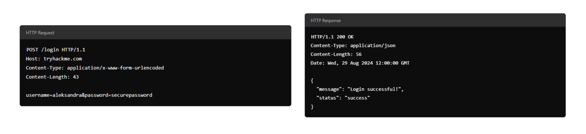

# Web Applications Security

This guide covers fundamental concepts in web application security, starting with the basics of how web communications work and building up to common vulnerabilities and attack vectors. Understanding these fundamentals is crucial for both developers and security professionals.

## Table of Contents

- [Uniform Resource Locator (URL)](#uniform-resource-locator-url)
  - [Anatomy of a URL](#anatomy-of-a-url)
  - [Scheme](#scheme)
  - [User](#user)
  - [Host/Domain](#hostdomain)
  - [Port](#port)
  - [Path](#path)
  - [Query String](#query-string)
  - [Fragment](#fragment)
- [HTTP Messages](#http-messages)
  - [Start Line](#start-line)
  - [Headers](#headers)
  - [Empty Line](#empty-line)
  - [Body](#body)
  - [Why Understanding HTTP Messages Matters](#why-understanding-http-messages-matters)
- [Request Line](#request-line)
  - [HTTP Methods](#http-methods)
    - [GET](#get)
    - [POST](#post)
    - [PUT](#put)
    - [DELETE](#delete)
    - [PATCH](#patch)
    - [HEAD](#head)
    - [OPTIONS](#options)
    - [TRACE](#trace)
    - [CONNECT](#connect)
  - [URL Path](#url-path)
  - [HTTP Version](#http-version)
- [Common Status Codes](#common-status-codes)
  - [100 (Continue)](#100-continue)
  - [200 (OK)](#200-ok)
  - [301 (Moved Permanently)](#301-moved-permanently)
  - [404 (Not Found)](#404-not-found)
  - [500 (Internal Server Error)](#500-internal-server-error)

## Uniform Resource Locator (URL)

A Uniform Resource Locator (URL) is a web address that lets you access all kinds of online content—whether it's a webpage, a video, a photo, or other media. It guides your browser to the right place on the Internet.

### Anatomy of a URL

Think of a URL as being made up of several parts, each playing a different role in helping you find the right resource. Understanding how these parts fit together is important for browsing the web, developing web applications, and even troubleshooting problems.

Here's a breakdown of the key components:

#### Scheme

The scheme is the protocol used to access the website. The most common are HTTP (HyperText Transfer Protocol) and HTTPS (Hypertext Transfer Protocol Secure). HTTPS is more secure because it encrypts the connection, which is why browsers and cyber security experts recommend it. Websites often enforce HTTPS for added protection.

#### User

Some URLs can include a user's login details (usually a username) for sites that require authentication. This happens mostly in URLs that need credentials to access certain resources. However, it's rare nowadays because putting login details in the URL isn't very safe—it can expose sensitive information, which is a security risk.

#### Host/Domain

The host or domain is the most important part of the URL because it tells you which website you're accessing. Every domain name has to be unique and is registered through domain registrars. From a security standpoint, look for domain names that appear almost like real ones but have small differences (this is called typosquatting). These fake domains are often used in phishing attacks to trick people into giving up sensitive info.

#### Port

The port number helps direct your browser to the right service on the web server. It's like telling the server which doorway to use for communication. Port numbers range from 1 to 65,535, but the most common are 80 for HTTP and 443 for HTTPS.

#### Path

The path points to the specific file or page on the server that you're trying to access. It's like a roadmap that shows the browser where to go. Websites need to secure these paths to make sure only authorised users can access sensitive resources.

#### Query String

The query string is the part of the URL that starts with a question mark (?). It's often used for things like search terms or form inputs. Since users can modify these query strings, it's important to handle them securely to prevent attacks like injections, where malicious code could be added.

#### Fragment

The fragment starts with a hash symbol (#) and helps point to a specific section of a webpage—like jumping directly to a particular heading or table. Users can modify this too, so like with query strings, it's important to check and clean up any data here to avoid issues like injection attacks.

## HTTP Messages

HTTP messages are packets of data exchanged between a user (the client) and the web server. These messages are very important for understanding how web applications work because they show how users' requests and the server's responses are communicated.

Imagine an example of an HTTP Request and an HTTP Response, where you can see key parts like the method, URL, headers, and status codes. These are what make the client-server interaction possible.

There are two types of HTTP messages:

- **HTTP Requests**: Sent by the user to trigger actions on the web application.
- **HTTP Responses**: Sent by the server in response to the user's request.

Each message follows a specific format that helps both the user and the server communicate smoothly.

### Start Line

The start line is like the introduction of the message. It tells you what kind of message is being sent—whether it's a request from the user or a response from the server. This line also gives important details about how the message should be handled.

### Headers

Headers are made up of key-value pairs that provide extra information about the HTTP message. They give instructions to both the client and the server handling the request or response. These headers cover all sorts of things, like security, content types, and more, making sure everything goes smoothly in the communication.

### Empty Line

The empty line is a little divider that separates the header from the body. It's essential because it shows where the headers stop and where the actual content of the message begins. Without this empty line, the message might get messed up, and the client or server could misinterpret it, causing errors.

### Body

The body is where the actual data is stored. In a request, the body might include data the user wants to send to the server (like form data). In a response, it's where the server puts the content that the user requested (like a webpage or API data).

### Why Understanding HTTP Messages Matters

- These messages are the foundation of how web applications communicate. If they're structured properly, everything works smoothly.
- Knowing how they work will help you diagnose issues in web communication, which means better performance and reliability for your web application.
- It's also crucial for security. Understanding HTTP messages helps you implement strong security measures to protect data during transmission.

## Request Line

The request line (or start line) is the first part of an HTTP request and tells the server what kind of request it's dealing with. It has three main parts: the HTTP method, the URL path, and the HTTP version.

**Example:** `METHOD /path HTTP/version`

### HTTP Methods

The HTTP method tells the server what action the user wants to perform on the resource identified by the URL path. Here are some of the most common methods and their possible security issues:

#### GET
Used to fetch data from the server without making any changes. **Reminder!** Make sure you're only exposing data the user is allowed to see. Avoid putting sensitive info like tokens or passwords in GET requests since they can show up as plaintext.

#### POST
Sends data to the server, usually to create or update something. **Reminder!** Always validate and clean the input to avoid attacks like SQL injection or XSS.

#### PUT
Replaces or updates something on the server. **Reminder!** Make sure the user is authorised to make changes before accepting the request.

#### DELETE
Removes something from the server. **Reminder!** Just like with PUT, make sure only authorised users can delete resources.

Besides these common methods, there are a few others used in specific cases:

#### PATCH
Updates part of a resource. It's useful for making small changes without replacing the whole thing, but always validate the data to avoid inconsistencies.

#### HEAD
Works like GET but only retrieves headers, not the full content. It's handy for checking metadata without downloading the full response.

#### OPTIONS
Tells you what methods are available for a specific resource, helping clients understand what they can do with the server.

#### TRACE
Similar to OPTIONS, it shows which methods are allowed, often for debugging. Many servers disable it for security reasons.

#### CONNECT
Used to create a secure connection, like for HTTPS. It's not as common but is critical for encrypted communication.

Each of these methods has its own set of security rules. For example, PATCH requests should be validated to avoid inconsistencies, and OPTIONS and TRACE should be turned off if not needed to avoid possible security risks.

### URL Path

The URL path tells the server where to find the resource the user is asking for. For instance, in the URL `https://tryhackme.com/api/users/123`, the path `/api/users/123` identifies a specific user.

Attackers often try to manipulate the URL path to exploit vulnerabilities, so it's crucial to:

- Validate the URL path to prevent unauthorised access
- Sanitise the path to avoid injection attacks
- Protect sensitive data by conducting privacy and risk assessments

Following these practices helps protect your web application from common attacks.

### HTTP Version

The HTTP version shows the protocol version used to communicate between the client and server. Here's a quick rundown of the most common ones:

#### HTTP/0.9 (1991)
The first version, only supported GET requests.

#### HTTP/1.0 (1996)
Added headers and better support for different types of content, improving caching.

#### HTTP/1.1 (1997)
Brought persistent connections, chunked transfer encoding, and better caching. It's still widely used today.

#### HTTP/2 (2015)
Introduced features like multiplexing, header compression, and prioritisation for faster performance.

#### HTTP/3 (2022)
Built on HTTP/2, but uses a new protocol (QUIC) for quicker and more secure connections.

Although HTTP/2 and HTTP/3 offer better speed and security, many systems still use HTTP/1.1 because it's well-supported and works with most existing setups. However, upgrading to HTTP/2 or HTTP/3 can provide significant performance and security improvements as more systems adopt them.

## Common Status Codes

Here are some of the most frequently seen status codes:

### 100 (Continue)
The server got the first part of the request and is ready for the rest.

### 200 (OK)
The request was successful, and the server is sending back the requested resource.

### 301 (Moved Permanently)
The resource you're requesting has been permanently moved to a new URL. Use the new URL from now on.

### 404 (Not Found)
The server couldn't find the resource at the given URL. Double-check that you've got the right address.

### 500 (Internal Server Error)
Something went wrong on the server's end, and it couldn't process your request.

---

*This document will be expanded with additional web application security concepts and techniques.*
